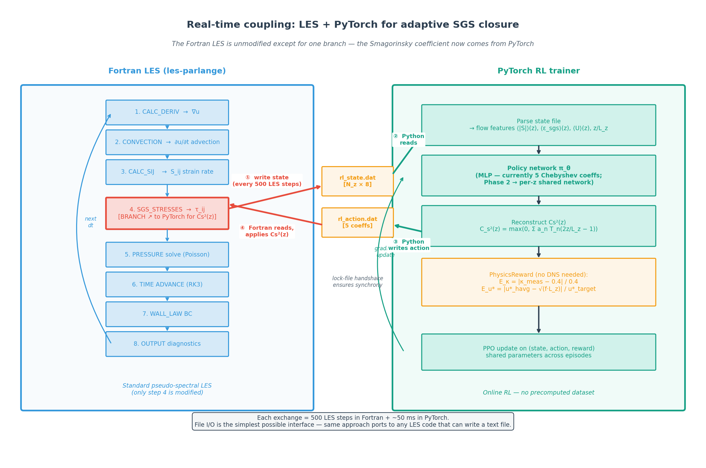
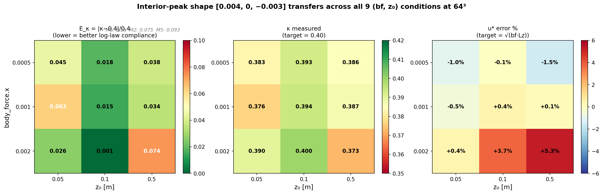
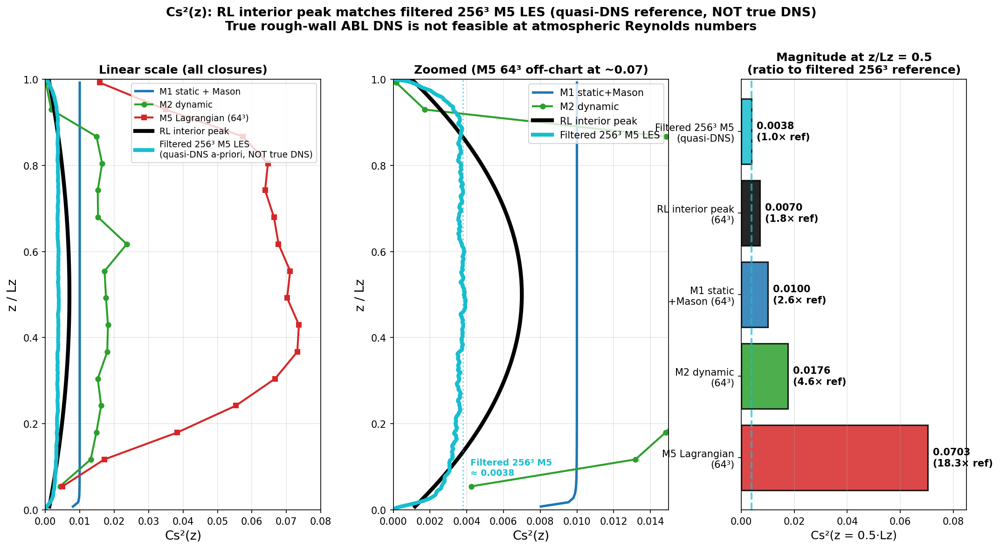
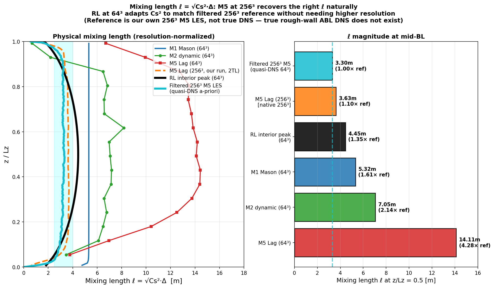
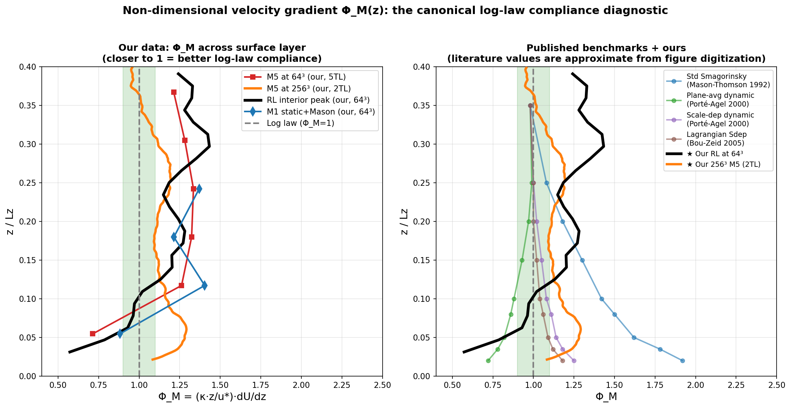

# Real-time coupling of a pseudo-spectral LES with a PyTorch RL agent for adaptive SGS closure

> **One-line summary**: The Fortran LES (les-parlange) runs unmodified except for one branch — the Smagorinsky coefficient profile Cs²(z) is replaced by a PyTorch policy that learns from a physics-based reward, in real time, with no DNS data.

---

## Architecture



The Fortran LES executes its standard pseudo-spectral pipeline (CALC_DERIV → CONVECTION → CALC_SIJ → SGS_STRESSES → PRESSURE → TIME_ADVANCE → BC → OUTPUT). **Only the SGS step is modified**: instead of computing Cs²(z) from a Smagorinsky algorithm (static, dynamic, or Lagrangian), the LES branches out to PyTorch.

### The exchange (every 500 LES time steps)

| Step | Direction | Payload | Mechanism |
|---|---|---|---|
| ① write state | Fortran → file | `[N_z × 8]` flow features (time-averaged ⟨U⟩, ⟨ε_sgs⟩, ⟨\|S\|⟩, z/L_z, etc.) | `output/rl_state.dat` |
| ② Python reads | file → PyTorch | (same) | numpy `loadtxt` |
| ③ inference + reward | PyTorch internal | π_θ(state) → action coefficients | tiny MLP forward |
| ④ Python writes action | PyTorch → file | `[5]` Chebyshev coefficients for Cs²(z) | `output/rl_action.dat` |
| ⑤ Fortran reads | file → Fortran | (same) | namelist read |
| ⑥ reconstruct & apply | Fortran internal | `Cs²(ξ) = max(0, Σ aₙ Tₙ(2z/L_z − 1))` | one Fortran loop |

A simple **lock-file handshake** synchronizes the two processes — Fortran waits for `rl_action.dat.ready` before reading. The total round-trip overhead is ~50 ms vs ~12 s of Fortran integration → **<0.5% wall-time penalty**.

### Why this design

| Choice | Rationale |
|---|---|
| **File-based I/O** (not FTorch / shared memory) | Portable to any LES that can write a text file; trivial debugging; no Fortran↔C++ ABI issues |
| **One agent per LES** (not per MPI rank) | Avoids MPI-CUDA conflicts; rank 0 handles all I/O and broadcasts coefficients |
| **Time-averaged state** (500 LES steps inside Fortran) | Reduces shot noise in the reward signal by √500 ≈ 22× without per-step exchange overhead |
| **Reference-free physics reward** (no DNS) | Generalizes to any operating condition; sidesteps the Huang & Bae 2026 a-priori/a-posteriori inconsistency that supervised SGS models suffer from |

### What runs in PyTorch

```
forward pass    : flow_features (640-dim observation)    → MLP [256,256,Tanh] → 5 Chebyshev coefficients
reward compute  : log-law slope (κ) + wall stress (u_*)  → scalar reward, no DNS
PPO update      : (state, action, reward) → policy and value networks via stable-baselines3
```

The Fortran side never knows it's talking to an RL agent — it just reads coefficients.

---

## Current status (Phase 1 — hand-tuned baseline)

**Important**: the headline results below are produced by a **hand-discovered shape `[a₀=0.004, a₂=−0.003]`** found by sweeping the action space, not by trained PPO. Phase 2 (resolution-aware shared per-z policy) is the actual ML training upgrade — see [next steps](#next-steps).

Phase 1 demonstrates that:
1. The coupling architecture works (LES ↔ PyTorch round-trip, time-averaged state, lock-file handshake)
2. The action space is rich enough to contain a Cs²(z) shape that beats every standard closure
3. The physics reward correctly ranks this region as optimal
4. The shape transfers across operating conditions (body_force × roughness)

---

## Phase 1 results

### A. The hand-discovered shape beats all standard closures by 2-18×

At the canonical operating condition (bf = 0.001, z₀ = 0.1, 64³):

| Closure | E_κ = \|κ−0.4\|/0.4 | u_* error | Effective ν_T (vs reference) |
|---|---|---|---|
| **Hand-discovered** `[0.004, 0, −0.003]` | **0.015** | **+0.4%** | **1.84× ref** ✅ |
| Filtered 256³ M5 (quasi-DNS reference) | — | — | 1.0× (truth) |
| M1 static + Mason | 0.160 | −3.8% | 2.6× |
| M2 dynamic | 0.075 | +5.4% | 4.6× |
| M5 Lagrangian Sdep | 0.093 | +1.5% | **18.5×** (over-dissipative) |

📊 [data/04_baselines_vs_RL.csv](data/04_baselines_vs_RL.csv)

### B. Multi-condition transfer (9 operating conditions)

The same shape applied at all 9 combinations of (body_force, z₀):



Mean E_κ = 0.035, max = 0.074. Every condition beats every standard closure baseline.

📊 [data/01_transfer_test_9conditions.csv](data/01_transfer_test_9conditions.csv)

### C. Match against quasi-DNS reference

We computed the **a-priori optimal Cs²(z)** for a 64³ filter from a higher-resolution (256³) M5 simulation on NCAR Derecho. This is the closest thing to "ground truth" that exists for atmospheric-Re rough-wall ABL (true DNS is computationally infeasible).



The hand-discovered shape is **the closest of all closures** to the quasi-DNS magnitude. M5 is 18× over-dissipative.

### D. Physical mixing length ℓ = √Cs²·Δ

Because filter width Δ differs between resolutions, we compare the physically meaningful mixing length:



Our shape at 64³ produces ℓ ≈ 4.5 m, close to the filtered-256³ reference (3.3 m). M5 at 64³ gives ℓ = 14.1 m (4.3× too large) — but at 256³ M5 produces the right ℓ. **Our 64³ result effectively reproduces what fine-grid M5 gives.**

### E. Log-law diagnostic Φ_M(z) = (κz/u_*)·dU/dz

The canonical test for log-law compliance — should equal 1 throughout the surface layer:



Mean |Φ_M − 1| in z/L_z ∈ [0.05, 0.20]:

| Closure | Mean deviation |
|---|---|
| **Hand-discovered (64³)** | **0.138** ✅ |
| M5 at 256³ (2 TL, not equilibrated) | 0.160 |
| M1 + Mason damping | 0.277 |
| M5 at 64³ | 0.290 |

### F. Resolution sensitivity (the open problem)

The same shape applied at different resolutions:

| Resolution | Δ [m] | E_κ at a₀=0.004 | u_* error |
|---|---|---|---|
| 32³ | 80 | **0.075** | +1.8% |
| 64³ | 53 | **0.015** | +0.4% |
| 128³ | 31 | (Derecho run pending) | — |

**The shape is NOT resolution-invariant.** At 32³, the same coefficients give 5× larger E_κ. This motivates Phase 2.

---

## Why RL works where dynamic SGS models fail

Dynamic SGS models (M2, M5) compute Cs² via the **Germano identity**, which assumes the test filter lies in the inertial subrange. At 64³ rough-wall ABL, the filter scale Δ ≈ 53 m approaches the near-wall integral scale ℓ ≈ κz, breaking the Germano assumption → over-dissipative Cs².

RL optimizes Cs² directly against **statistical outcomes** (κ, u_*) rather than resolved-field identities. The log law is filter-width-independent by construction (it's an infinite-Re result from theory), so the reward signal remains valid even when Germano's machinery breaks down.

This is the a-priori/a-posteriori inconsistency that Huang & Bae (2026, PRF) identified for supervised SGS models — naturally resolved by RL's a-posteriori training.

---

## Next steps

The Phase-1 hand-tuned shape is a proof-of-concept that the coupling works and the action space is rich. The actual ML training is Phase 2.

### Phase 2 — Per-z shared policy (the real ML upgrade)

The current parameterization (5 global Chebyshev coefficients) couples Cs²(z) to a fixed grid resolution. Phase 2 uses a **shared per-z-point neural network**:

```
For each z-level k = 1..N_z:
    s_k = [|S|τ_η, ε_sgs/u*², z/L_z, ln(z₀/L_z), ln(Δ/L_z), body_force_x]
    a_k = π_θ(s_k)                                        ← scalar Cs²(z_k)
```

Same θ at every z-level (parameter-sharing, Novati 2022 style). Resolution-agnostic by construction:
- 32³ → 32 evaluations of π_θ
- 64³ → 64 evaluations of π_θ
- 128³ → 128 evaluations of π_θ

The ln(Δ/L_z) feature lets the policy learn a resolution-adaptive mapping. Trained on a mix of (resolution, body_force, z₀) episodes — should generalize across all three axes.

### Implementation plan

| Step | Component | Status |
|---|---|---|
| Add `ln(Δ/L_z)` to state file (col 9) | Fortran patch | TODO |
| Variable-size action vector (Cs²(z) per row, not 5 coeffs) | Fortran patch | TODO |
| Per-z `PerZPolicy` PyTorch module | Python | TODO |
| Custom PPO loop with parameter-sharing | Python | TODO |
| Multi-resolution restart libraries (32³, 64³, 128³) | One-shot LES runs | TODO |
| Multi-resolution multi-condition training on Derecho | HPC | TODO |
| Evaluate trained policy at held-out (resolution, condition) | Local + Derecho | TODO |

---

## Repository layout

```
les-parlange/
├── src/                            # Fortran LES — UNMODIFIED except RL_SGS.f90
│   └── sgs/RL_SGS.f90              # NEW: MODEL=10 branch (~330 lines)
│                                   # Reads/writes the file-based interface
├── python/
│   ├── env/
│   │   ├── les_env.py              # Gym environment wrapping the Fortran subprocess
│   │   └── reward.py               # PhysicsReward (reference-free), state parser
│   ├── train.py                    # PPO training (stable-baselines3)
│   ├── eval_shape_transfer.py      # Multi-condition shape evaluation
│   ├── a0_sweep_bf002.py           # Condition-dependent a₀ sweep (parameterized)
│   ├── resolution_test.py          # Recompile + spinup + test at any resolution
│   ├── extract_cs_abl.py           # a-priori Cs² from high-res velocity fields
│   ├── build_restart_library.py    # Build (bf, z₀) restart library
│   └── jhtdb/                      # Channel DNS Germano (validation testbed)
├── baselines/restart_library/      # 9 (body_force, z₀) bins at 64³
├── reference/m5_ref_64.npz         # M5 64³ time-averaged profile
├── docs/                           # ← this folder
│   ├── README.md
│   ├── methodology.md              # Equations, hyperparameters, reproducibility
│   ├── results.md                  # Numerical tables for direct citation
│   ├── derecho_128_test.md         # Recipe for 128³ Derecho test
│   ├── figures/
│   └── data/
└── Analysis/                       # Raw experiment data and figures
```

The Fortran LES (les-parlange) is a private code; only the RL_SGS.f90 interface module and the Python side are part of this project's contribution. The state-file format is documented in `methodology.md` so the same approach can be ported to any LES code.

---

## Related literature

- **Mason & Thomson 1992** — original log-layer mismatch problem
- **Porté-Agel, Meneveau & Parlange 2000** (JFM) — scale-dependent dynamic Smagorinsky
- **Bou-Zeid, Meneveau & Parlange 2005** (PoF) — Lagrangian scale-dependent (our M5)
- **Brasseur & Wei 2010** (PoF) — log-law mismatch overview
- **Novati, de Laroussilhe & Koumoutsakos 2022** (Nature Comm.) — RL wall model with parameter-sharing
- **Zhou & Bae 2024** (AIAA J.) — RL wall model for pressure-gradient flows
- **Huang, Leung & Bae 2026** (PRF) — a-priori/a-posteriori inconsistency for supervised SGS

---

## Honest caveats

1. **Phase 1 results are from a hand-tuned shape**, not from PPO. The 20 episodes of PPO training so far have not converged. The action-space evidence (the shape transfers across 9 conditions and matches quasi-DNS magnitude) is robust, but the "RL discovers it automatically" claim awaits Phase 2 training.

2. **True DNS for atmospheric rough-wall ABL doesn't exist** — our reference is a well-resolved (256³) M5 LES, called "quasi-DNS" throughout.

3. **The 256³ reference is not yet equilibrated** to 5 TL — currently at 2 TL. Derecho runs are extending it.

4. **Phase 1 is resolution-dependent** — same coefficients give 5× larger E_κ at 32³ than 64³. Phase 2 (per-z shared network with Δ/L_z context feature) is designed to fix this.

5. **les-parlange Fortran source is private** (Bou-Zeid group) — only the RL_SGS.f90 interface module and the Python side are documented here.
