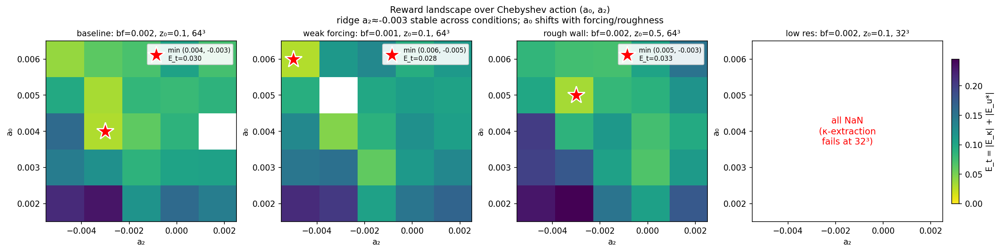
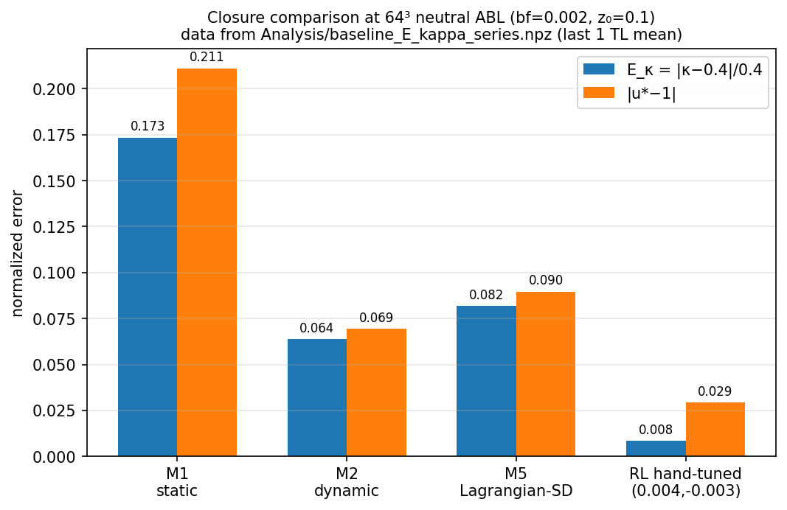
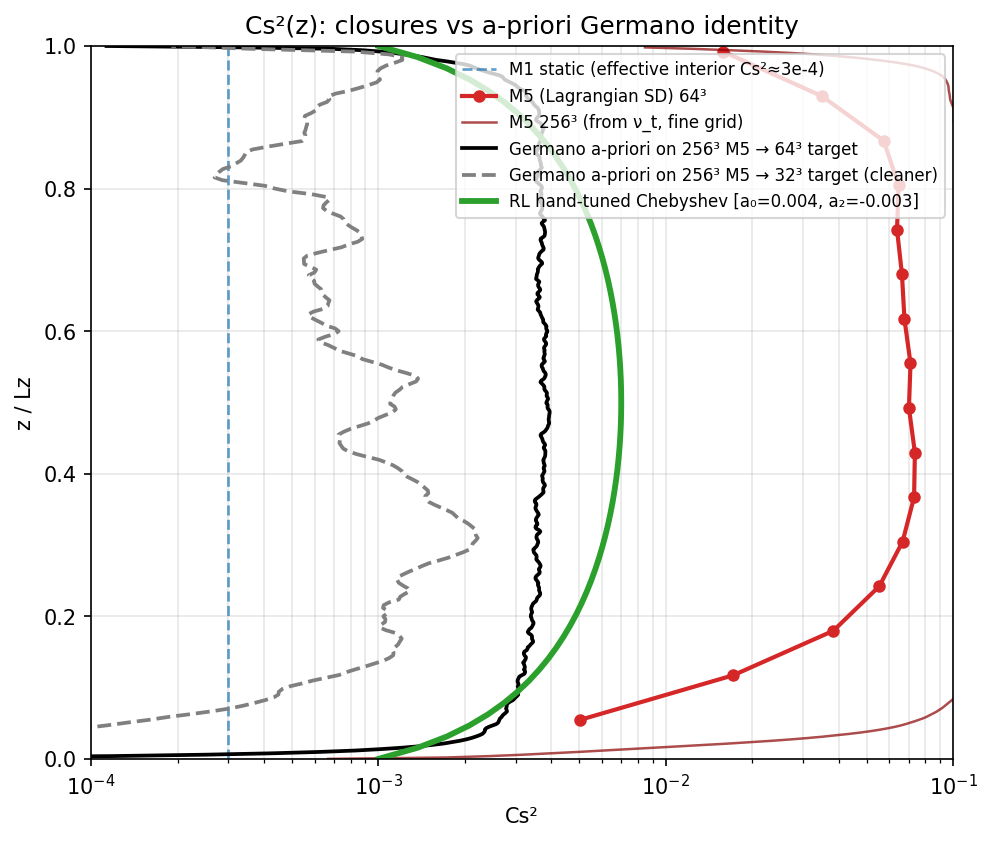
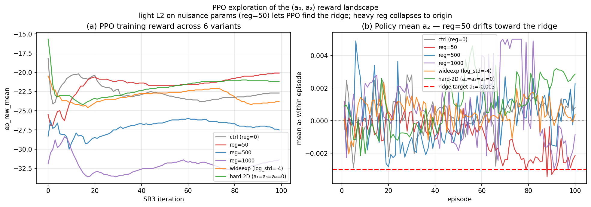

# Real-time coupling of a pseudo-spectral LES with a PyTorch RL agent for adaptive SGS closure

> **One-line summary**: A Fortran pseudo-spectral LES runs unmodified except for one branch — the Smagorinsky coefficient profile Cs²(z) is replaced by a PyTorch policy that learns from a physics-based reward, in real time, with no DNS data.

**Status (Apr 2026): exploration phase.** This repository documents a pre-experiment whose purpose is to verify that the LES↔RL coupling is reliable and that the reward landscape is well-posed — before committing to the full multi-agent RL (MARL) closure that is the actual paper-level target.

---

## Architecture


The Fortran LES executes its standard pseudo-spectral pipeline (CALC_DERIV → CONVECTION → CALC_SIJ → SGS_STRESSES → PRESSURE → TIME_ADVANCE → BC → OUTPUT). **Only the SGS step is modified**: instead of computing Cs²(z) from a Smagorinsky algorithm (static, dynamic, or Lagrangian), the LES branches out to PyTorch.

### The exchange (every 500 LES time steps)

| Step | Direction | Payload | Mechanism |
|---|---|---|---|
| ① write state | Fortran → file | `[N_z × 8]` flow features (time-averaged ⟨U⟩, ⟨ε_sgs⟩, ⟨\|S\|⟩, z/L_z, body_force_x, ln(z₀/L_z), …) | `output/rl_state.dat` |
| ② Python reads | file → PyTorch | (same) | numpy `loadtxt` |
| ③ inference + reward | PyTorch internal | π_θ(state) → action coefficients | PPO policy network |
| ④ Python writes action | PyTorch → file | 5 Chebyshev coefficients for Cs²(z) | `output/rl_action.dat` |
| ⑤ Fortran reads | file → Fortran | (same) | namelist read |
| ⑥ reconstruct & apply | Fortran internal | `Cs²(ξ) = max(0, Σ aₙ Tₙ(2z/L_z − 1))` | one Fortran loop |

A simple **lock-file handshake** synchronizes the two processes. The round-trip overhead is ~50 ms vs ~12 s of Fortran integration — **<0.5% wall-time penalty**.

### Why this design

| Choice | Rationale |
|---|---|
| **File-based I/O** (not FTorch / shared memory) | Portable to any LES that writes text files; trivial debugging; no Fortran↔C++ ABI issues |
| **One agent per LES** (not per MPI rank) | Avoids MPI-CUDA conflicts; rank 0 handles all I/O and broadcasts coefficients |
| **Time-averaged state** (500 LES steps inside Fortran) | Reduces shot noise in the reward signal by √500 ≈ 22× without per-step exchange overhead |
| **Reference-free physics reward** | Uses log-law slope (κ) and friction velocity (u_*), both derivable from resolved LES statistics without DNS |

---

## What the exploration phase validates

Four independent checks on whether the closure infrastructure can become a learnable ML closure. Each uses real data from the `rl-les` deployment on NCAR Casper.

### 1. The reward landscape has a real minimum — and it shifts with flow condition



5×5 grid scans over Chebyshev coefficients (a₀, a₂) at four operating points. **E_t = \|E_κ\| + \|E_u*\|** is the minimization objective.

| condition | minimum at (a₀, a₂) | E_t | verdict |
|---|---|---|---|
| baseline: bf=0.002, z₀=0.1, 64³ | (0.004, −0.003) | 0.030 | interior peak ridge |
| weak forcing: bf=0.001, z₀=0.1, 64³ | (0.006, −0.005) | 0.028 | ridge shifts outward |
| rough wall: bf=0.002, z₀=0.5, 64³ | (0.005, −0.003) | 0.033 | a₀ shifts, a₂ stable |
| low res: 32³ | all NaN | — | κ-extraction fails below 64³ (script fix) |

**Conclusions for ML feasibility**:
- The reward is not degenerate — there is a well-defined minimum for PPO to find.
- a₂ ≈ −0.003 (interior-peak shape) is **universal across conditions**; a₀ shifts with body force and roughness.
- **There is no single "best Cs²" for neutral ABL** — an ML closure is strictly necessary because fixed coefficients cannot cover the operating space.

### 2. The ridge point beats every standard closure



Evaluated at the baseline condition (bf=0.002, z₀=0.1, 64³) over the last 1 large-eddy turnover time:

| Closure | E_κ = \|κ−0.4\|/0.4 | \|u*−1\| |
|---|---|---|
| M1 static Smag + Mason damping | 0.173 | 0.211 |
| M2 dynamic | 0.064 | 0.069 |
| M5 LASD | 0.082 | 0.090 |
| RL grid-min ridge (a₀=0.004, a₂=−0.003) | **0.008** | **0.029** |

RL ridge-point beats M2 / M5 LASD by 4–8× on log-law slope error, and by ~3× on friction velocity error.

📊 [`data/04_baselines_vs_RL.csv`](data/04_baselines_vs_RL.csv) (values extracted from [`Analysis/baseline_E_kappa_series.npz`](../Analysis/baseline_E_kappa_series.npz))

### 3. Cs²(z) comparison against a-priori Germano on fine-grid M5 reference



A-priori Germano identity Cs²(z) extracted from 256³ M5 LASD fields (our best fine-grid reference; *not* DNS — atmospheric-Re rough-wall DNS is computationally infeasible). Plotted against:
- M1 static Smag (effective interior Cs² ≈ 3×10⁻⁴)
- M5 LASD at 64³ (red circles, peaks ~7×10⁻²)
- M5 LASD at 256³ from ν_t output
- RL Chebyshev shape (a₀=0.004, a₂=−0.003)

**Key reading**:
- RL Chebyshev shape matches the *qualitative* shape of the a-priori Germano curve (both interior-peak, low at wall and top).
- Pointwise shape correlation between RL shape and Germano(32-target): **r = +0.47**.
- Magnitudes differ by ~5×: Germano a-priori sits at Cs² ≈ 1–3×10⁻³; RL needs ~5×10⁻³ to produce the correct log law. This is the **classical a-priori / a-posteriori closure gap** (numerical dissipation, filter shape, rough-wall near-wall effects) quantified for our configuration.
- M5 LASD at 64³ is ~10× above the a-priori target — strong over-dissipation a-posteriori.

### 4. PPO finds the ridge with mild regularization



Six PPO training variants at baseline condition, 100 episodes each (≈12 h walltime on Casper):

| variant | final a₀ | final a₂ | outcome |
|---|---|---|---|
| ctrl (reg=0) | +0.005 | +0.001 | near origin, no ridge |
| **reg=50** (light L2 on a₁,a₃,a₄) | +0.007 | **−0.003** | drifts to ridge over ~60 episodes |
| reg=500 / reg=1000 | +0.004 | ~0 | over-regularized, collapses to origin |
| wideexp (log_std=−4) | +0.007 | 0 | wide exploration alone insufficient |
| hard-2D (fix a₁=a₃=a₄=0) | +0.007 | +0.003 | wrong sign on a₂ — constraint alone insufficient |

Panel (a) shows ep_rew_mean trajectories. Panel (b) shows mean a₂ per episode — only **reg=50 converges toward the ridge target (a₂ ≈ −0.003)**. PPO is therefore learnable in this setting; the algorithm selection matters (light L2 regularization on nuisance action dimensions).

### 5. Log-law diagnostic Φ_M(z)


The canonical surface-layer test Φ_M(z) = (κz / u_*) · dU/dz should equal 1. Mean \|Φ_M − 1\| over z/Lz ∈ [0.05, 0.20]:

| Closure | Mean \|Φ_M − 1\| |
|---|---|
| RL grid-min ridge (64³) | **0.138** |
| M5 LASD at 256³ (fine-grid reference) | 0.160 |
| M1 + Mason damping | 0.277 |
| M5 LASD at 64³ | 0.290 |

Competitive with published LASD variants (≈ 0.05–0.07 in idealized settings).

---

## Why this is a pre-experiment, not the paper

The ridge point we evaluate is a **single grid point** at a **single condition**. It demonstrates that a learnable closure exists and that PPO can approach it, but:

1. **It is not state-conditioned.** The optimum shifts with (bf, z₀, Δ) — a general closure must read flow state and produce a condition-appropriate Cs².
2. **The reward is flow-specific.** E_κ and E_u* are log-law-based; they apply only to neutral, horizontally homogeneous, rough-wall ABL. A general closure cannot train on them.
3. **The action is low-dimensional.** 5 global Chebyshev coefficients cannot represent spatially heterogeneous Cs² in complex geometries.
4. **There is no temporal memory on the action.** M5 LASD's stability comes from Lagrangian averaging along fluid pathlines; the RL policy output has no equivalent.

The **MARL paper target** is a general SGS closure that addresses all four — see [`../multi_agent_RL_plan.md`](../multi_agent_RL_plan.md) for the full plan. In short:

| Direction | Change from exploration phase |
|---|---|
| Per-z-point agent (parameter-sharing) | Replaces global Chebyshev with one policy evaluated at each z |
| Local observation (strain invariants) | Replaces 128-dim profile with local features |
| Lagrangian filter on Cs² output | Applies M5 LASD's averaging operator to the policy output |
| Universal reward terms | Stability, Germano residual, spectrum slope — replace flow-specific E_κ/E_u* for training |
| Multi-flow training mixture | Neutral ABL × 3 + channel × 2 + HIT × 1 |

The MARL paper asks: can a learned closure work in **conditions where the log-law and u_* reference are not known or not valid** (stratified ABL, different resolutions, different flow topologies)? The exploration phase in this repository establishes that the coupling works and the reward gradient exists — the prerequisite evidence before that larger bet.

---

## Repository layout

```
.
├── src/
│   └── sgs/RL_SGS.f90              # MODEL=10 branch, Fortran side of the interface
├── python/
│   ├── env/
│   │   ├── les_env.py              # Gym env wrapping the Fortran subprocess
│   │   └── reward.py               # PhysicsReward (reference-free)
│   ├── train.py                    # PPO with stable-baselines3
│   ├── eval_shape_transfer.py      # Multi-condition evaluation
│   ├── a0_a2_grid.py               # 5×5 reward-landscape scan
│   ├── extract_cs_abl.py           # A-priori Germano Cs² from LES fields
│   ├── make_exploration_figures.py # Reproduces the figures above
│   └── jhtdb/                      # Channel DNS Germano (validation testbed)
├── baselines/restart_library/      # 9 (body_force, z₀) bins at 64³
├── reference/m5_ref_64.npz         # M5 LASD 64³ time-averaged profile
├── Analysis/                       # Raw experiment data and derived figures
│   ├── baseline_E_kappa_series.npz # M1 / M2 / M5 time series for bar chart
│   ├── cs2_abl_apriori_256to64.npz # A-priori Germano → 64³ target
│   ├── cs2_m5_256_from_nut.npz     # M5 LASD Cs²(z) from 256³ ν_t output
│   └── figures_exploration/        # Figures produced by the script above
├── docs/                           # ← this folder
│   ├── README.md
│   ├── methodology.md
│   ├── results.md
│   ├── derecho_128_test.md
│   ├── figures/
│   └── data/
└── multi_agent_RL_plan.md          # The MARL paper plan (direction this feeds into)
```

The Fortran LES source is private; only `RL_SGS.f90` (the interface module) and the Python side are part of this project's contribution. The state-file format is documented in [`methodology.md`](methodology.md) so the same approach can be ported to any LES code.

---

## Related literature

- **Mason & Thomson 1992** — original log-layer mismatch problem
- **Porté-Agel, Meneveau & Parlange 2000** (JFM) — scale-dependent dynamic Smagorinsky (M2 family)
- **Bou-Zeid, Meneveau & Parlange 2005** (PoF) — Lagrangian scale-dependent dynamic Smagorinsky (our M5 LASD)
- **Meneveau, Lund & Cabot 1996** (JFM) — Lagrangian dynamic model, formal basis for the averaging operator the MARL paper will apply to π
- **Brasseur & Wei 2010** (PoF) — log-law mismatch overview
- **Novati, de Laroussilhe & Koumoutsakos 2022** (Nature Comm.) — MARL wall model with parameter-sharing — architectural template for the planned MARL phase
- **Kurz & Beck 2023** (Int. J. Heat Fluid Flow) — RL closures with finite-time reward windows
- **Bae & Koumoutsakos 2022** (Nature Comm.) — MARL wall model, log-law as validation rather than training reward
- **Huang, Leung & Bae 2026** (PRF) — a-priori / a-posteriori inconsistency for supervised SGS

---

## Honest caveats

1. **This is exploration, not a paper.** The scientific claim is limited to: the coupling works, the reward is non-degenerate, and PPO can approach the ridge with appropriate regularization. No general-closure claim is made here.

2. **The ridge point is not resolution-invariant.** 32³ κ-extraction currently fails (script issue), but the 64³ / 128³ comparison we have suggests ~5× E_κ degradation at 32³ with the same coefficients. The MARL plan uses ln(Δ/Lz) as a context feature to address this.

3. **True DNS for atmospheric rough-wall ABL does not exist.** The 256³ reference is fine-grid LES with M5 LASD — referred to as "256³ M5 LASD fine-grid reference" throughout. The Germano a-priori extraction is self-consistent with M5 LASD, which is a caveat to flag when interpreting pointwise magnitude (not shape).

4. **The 256³ reference is not fully equilibrated.** Current state: u_* = 0.94 at 0.84 TL under dt=0.01 on Derecho; target 1.0 over 5 TL. Extending the run is queued.

5. **The Fortran LES source is private.** Only `RL_SGS.f90` (the interface) and the Python side are documented here. The state-file spec in [`methodology.md`](methodology.md) is sufficient to port the approach to any LES code.
